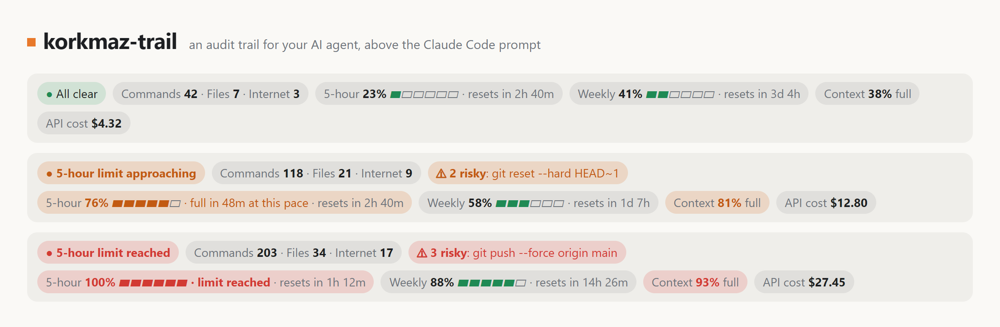

# korkmaz-trail

**English** · [Türkçe](README.tr.md)

**An audit trail for your AI agent, above the Claude Code prompt.**

Claude Code runs commands, edits files and reaches out to the web on your behalf. korkmaz-trail keeps a running record of what the agent actually did this session (commands, files changed, outbound calls, risky actions) and shows it next to the numbers you check anyway: your 5-hour and weekly plan limits, context and cost.

It stays quiet while everything is nominal and speaks up when something deserves a human look. It's a Claude Code [mod](https://code.claude.com/docs/en/plugins/mods/overview), so it draws in the Desktop app's Code tab and in the terminal alike.



## Reading the bar

Each fact gets its own chip:

| Chip | What it tells you |
|---|---|
| `● All clear` | The overall state in words: green when all is clear, amber or red with the most pressing reason, such as `Context filling up`, `5-hour limit approaching` or `High-risk action` |
| `Commands 118 · Files 21 · Internet 9` | Shell commands Claude ran this session, distinct files it created or edited, and calls that left your machine: web fetches and searches, remote URLs, network commands such as `git push`, `npm install` or `curl` |
| `⚠ 2 risky: git reset --hard` | Risky actions so far, and the latest one |
| `5-hour 76% ▰▰▰▰▰▱ · resets in 2h 40m` | How much of your 5-hour plan limit is used, and when it resets |
| `· full in 47m at this pace` | Appears only when, at your recent pace, you'd hit the limit before it resets |
| `Weekly 58% …` | The same for the weekly limit |
| `Context 81% full` | How full the conversation's context window is |
| `API cost $12.80` | What this session would cost at API list prices, as Claude Code estimates it. On a Pro or Max plan you aren't billed this. |

The bar starts in your system's language: Turkish on a Turkish system, English otherwise. Type `/korkmaz-trail` in Claude Code to see this legend, and `/korkmaz-trail tr` or `/korkmaz-trail en` to switch the language; the choice is remembered. The chips follow your theme. When the window is narrow they drop the weekly reset time and the cost first, then the gauges, then the words.

## What counts as risky

These are heuristics, not a sandbox: korkmaz-trail flags actions worth a second look. It never blocks or approves anything; every tool call passes through unchanged.

**High:** recursive deletes aimed at `/`, `~`, `$HOME`, `*` or `..`; `git push --force`; piping a download into a shell (`curl … | sh`, `irm … | iex`); disk formatting; `DROP TABLE`; `terraform destroy`, `kubectl delete`; a credential pasted into a command; reading SSH private keys, `.key`/`.p12` files or cloud CLI credentials.

**Medium:** `git reset --hard`, `git clean -f`, `--no-verify`; `sudo`; `chmod 777`; publishing (`npm publish`, `docker push`…); firewall, Defender or execution-policy changes; shutdowns; reading or editing `.env`, `secrets.*` or `.pem` files.

To keep false alarms down, heredoc bodies count as file contents rather than commands, and `.env.example`, globs (`ls .env*`) and flags (`--exclude=.env`) are ignored. A high-severity action turns the status red for 15 minutes, then amber for the rest of the session.

## Install

You need Claude Code with mods (v2.1.287 or later). Plan limits appear for Claude Pro and Max subscribers.

In a Claude Code session, add this repository as a plugin marketplace and install the plugin:

```text
/plugin marketplace add BersanKayraKorkmaz/korkmaz-trail
/plugin install korkmaz-trail@korkmaz-trail
```

The same from your shell:

```bash
claude plugin marketplace add BersanKayraKorkmaz/korkmaz-trail
claude plugin install korkmaz-trail@korkmaz-trail
```

Start a new session, or run `/reload-plugins`, and the bar appears above the prompt. To remove it, run `/plugin uninstall korkmaz-trail@korkmaz-trail`.

To try it from a clone without installing, start Claude Code with `claude --plugin-dir ./korkmaz-trail`.

## Privacy and safety

korkmaz-trail runs inside Claude Code, so it's worth knowing exactly what it touches. `claude plugin validate` lists every event a mod handles and every call it makes; for korkmaz-trail that's:

```text
hooks: session.start, classic.SessionStart{source=clear|resume|fork}, command.run{command=korkmaz-trail}, tool.call, session.measure, ui.render{component=AbovePrompt}
calls: $.clock.every, $.clock.now, $.command.register, $.session.messages, $.session.usage, $.store.get, $.store.set, $.ui.invalidate, $.ui.resolve
```

- No file access, network requests, processes or model calls, and no dependencies.
- The counters live in memory for the session. The only thing it saves is your language choice, in Claude Code's own plugin store.
- Detected credentials are never displayed. Everything it shows from a tool call is stripped of control characters, escape sequences and bidirectional overrides, so a crafted command can't repaint your screen.

## How the forecast works

Claude Code reports your plan usage after every turn and whenever a limit moves. korkmaz-trail keeps those readings in memory: the 5-hour forecast uses the burn rate over the last 30 minutes, the weekly one the last 6 hours, and with too little history it falls back to the window's average rate. Nothing is shown unless the projection crosses 100% before the reset.

## Known gaps

- When the mod joins a session late, after `/resume` or a fresh install, it rebuilds the trail from the conversation's recent messages.
- Commands that run inside MCP servers or other tools aren't seen.
- Pattern matching misses some risky actions and occasionally flags harmless ones. Use permission rules, hooks and sandboxing for enforcement; korkmaz-trail is for awareness.
- Mods are new, and their events can change between releases. Tested with Claude Code 2.1.286 on Windows, where mods were already rolling out.

## Development

```bash
npm test                 # rules and layout, with node:test
claude plugin test       # the mod itself, drawn for the terminal and the Desktop app
claude plugin validate .claude-plugin/plugin.json
npm run preview          # assets/preview.html and preview-tr.html, for screenshots
```

## License

MIT © 2026 Berşan Kayra Korkmaz

Not affiliated with or endorsed by Anthropic. Claude and Claude Code are trademarks of Anthropic.
