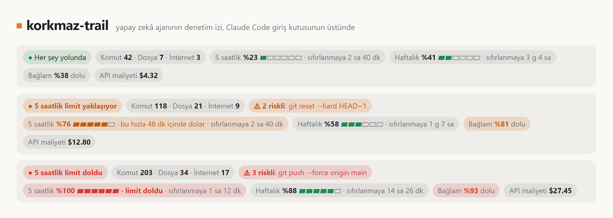

# korkmaz-trail

[English](README.md) · **Türkçe**

**Yapay zekâ ajanının denetim izi, Claude Code'da giriş kutusunun hemen üstünde.**

Claude Code senin adına komut çalıştırır, dosya düzenler ve internete çıkar. korkmaz-trail, ajanın bu oturumda gerçekte ne yaptığının kaydını tutar: çalıştırdığı komutlar, değiştirdiği dosyalar, dışarıya yaptığı çağrılar ve riskli işlemler. Bunları zaten takip ettiğin sayıların yanında gösterir: 5 saatlik ve haftalık plan limitlerin, bağlam doluluğu ve maliyet.

Her şey yolundayken sessiz kalır; bir insanın bakması gereken bir şey olduğunda sebebini söyleyerek uyarır. Bir Claude Code [mod'u](https://code.claude.com/docs/en/plugins/mods/overview) olduğu için masaüstü uygulamasının Code sekmesinde de terminalde de çalışır.



## Çubuğu okumak

Her bilgi kendi kutucuğunda durur:

| Kutucuk | Ne anlatır |
|---|---|
| `● Her şey yolunda` | Genel durum, kelimelerle: her şey yolundaysa yeşil; değilse turuncu ya da kırmızı ve en acil sebebiyle, ör. `Bağlam doluyor`, `5 saatlik limit yaklaşıyor`, `Yüksek riskli işlem` |
| `Komut 118 · Dosya 21 · İnternet 9` | Claude'un bu oturumda çalıştırdığı komutlar, oluşturduğu ya da değiştirdiği farklı dosyalar ve bilgisayarından dışarı çıkan çağrılar: web aramaları ve sayfa çekmeleri, uzak adresler, `git push`, `npm install`, `curl` gibi ağ komutları |
| `⚠ 2 riskli: git reset --hard` | Şimdiye kadarki riskli işlemlerin sayısı ve sonuncusu |
| `5 saatlik %76 ▰▰▰▰▰▱ · sıfırlanmaya 2 sa 40 dk` | 5 saatlik plan limitinin ne kadarının kullanıldığı ve ne zaman sıfırlanacağı |
| `· bu hızla 48 dk içinde dolar` | Yalnızca, son zamanlardaki hızınla limite sıfırlanmadan önce dayanacaksan çıkar |
| `Haftalık %58 …` | Aynısı, haftalık limit için |
| `Bağlam %81 dolu` | Konuşmanın bağlam penceresinin ne kadar dolu olduğu |
| `API maliyeti $12.80` | Bu oturumun API liste fiyatıyla tutarı, Claude Code'un kendi tahmini. Pro ya da Max planındaysan bu tutar senden çekilmez. |

Çubuk sistem dilinde açılır: Türkçe bir sistemde Türkçe, diğerlerinde İngilizce. Claude Code'da `/korkmaz-trail` yazarsan bu açıklamayı görürsün; `/korkmaz-trail tr` ya da `/korkmaz-trail en` ile dili değiştirirsin, tercih hatırlanır. Kutucuklar temanın renklerini kullanır. Pencere daralınca önce haftalık sıfırlanma süresi ve API maliyeti, sonra grafikler, en son da kelimeler kısalır.

## Neler riskli sayılır

Bunlar sezgisel işaretler, bir sandbox değil: korkmaz-trail ikinci kez bakmaya değer işlemleri işaretler. Hiçbir şeyi engellemez ya da onaylamaz; her araç çağrısı olduğu gibi geçer.

**Yüksek:** `/`, `~`, `$HOME`, `*` ya da `..` hedefleyen özyinelemeli silme; `git push --force`; indirilen bir şeyi doğrudan kabuğa vermek (`curl … | sh`, `irm … | iex`); disk biçimlendirme; `DROP TABLE`; `terraform destroy`, `kubectl delete`; bir komuta yapıştırılmış kimlik bilgisi; SSH özel anahtarlarını, `.key`/`.p12` dosyalarını ya da bulut CLI kimlik bilgilerini okumak.

**Orta:** `git reset --hard`, `git clean -f`, `--no-verify`; `sudo`; `chmod 777`; yayınlama (`npm publish`, `docker push`…); güvenlik duvarı, Defender ya da PowerShell çalıştırma ilkesi değişiklikleri; bilgisayarı kapatma; `.env`, `secrets.*` ya da `.pem` dosyalarını okumak veya düzenlemek.

Yanlış alarmları azaltmak için heredoc gövdeleri komut değil dosya içeriği sayılır; `.env.example`, joker karakterler (`ls .env*`) ve parametreler (`--exclude=.env`) yok sayılır. Yüksek riskli bir işlem durumu 15 dakika kırmızı yapar, sonra oturumun geri kalanında turuncu kalır.

## Kurulum

Mod destekli bir Claude Code gerekir (v2.1.287 ya da üstü). Plan limitleri Claude Pro ve Max abonelerinde görünür.

Bir Claude Code oturumunda bu repoyu eklenti pazar yeri olarak ekleyip eklentiyi kur:

```text
/plugin marketplace add BersanKayraKorkmaz/korkmaz-trail
/plugin install korkmaz-trail@korkmaz-trail
```

Aynısı terminalden:

```bash
claude plugin marketplace add BersanKayraKorkmaz/korkmaz-trail
claude plugin install korkmaz-trail@korkmaz-trail
```

Yeni bir oturum aç ya da `/reload-plugins` çalıştır; çubuk giriş kutusunun üstünde belirir. Kaldırmak için `/plugin uninstall korkmaz-trail@korkmaz-trail` yeterli.

Kurmadan denemek istersen repoyu klonla ve Claude Code'u `claude --plugin-dir ./korkmaz-trail` ile başlat.

## Gizlilik ve güvenlik

korkmaz-trail Claude Code'un içinde çalışır, bu yüzden tam olarak neye dokunduğunu bilmek önemli. `claude plugin validate`, bir mod'un dinlediği her olayı ve yaptığı her çağrıyı listeler. korkmaz-trail için çıktı şu:

```text
hooks: session.start, classic.SessionStart{source=clear|resume|fork}, command.run{command=korkmaz-trail}, tool.call, session.measure, ui.render{component=AbovePrompt}
calls: $.clock.every, $.clock.now, $.command.register, $.session.messages, $.session.usage, $.store.get, $.store.set, $.ui.invalidate, $.ui.resolve
```

- Dosya erişimi, ağ isteği, başka program çalıştırma ya da model çağrısı yok; bağımlılığı da yok.
- Sayaçlar oturum boyunca yalnızca bellekte tutulur. Kaydettiği tek şey, Claude Code'un kendi eklenti deposundaki dil tercihin.
- Yakalanan kimlik bilgileri asla gösterilmez. Bir araç çağrısından gösterdiği her metin kontrol karakterlerinden, kaçış dizilerinden ve çift yönlü metin işaretlerinden temizlenir; böylece özel hazırlanmış bir komut ekranını değiştiremez.

## Tahmin nasıl çalışır

Claude Code plan kullanımını her turdan sonra ve bir limit her değiştiğinde bildirir. korkmaz-trail bu ölçümleri bellekte tutar: 5 saatlik tahmin son 30 dakikadaki tüketim hızını, haftalık tahmin son 6 saati kullanır; yeterli geçmiş yoksa pencerenin ortalama hızına döner. Tahmin sıfırlanmadan önce %100'ü geçmiyorsa hiçbir şey gösterilmez.

## Bilinen eksikler

- Mod bir oturuma sonradan katılırsa (`/resume` ya da yeni kurulumdan sonra) izi konuşmanın son mesajlarından yeniden kurar.
- MCP sunucularının ya da başka araçların içinde çalışan komutlar görünmez.
- Örüntü eşleştirme bazı riskli işlemleri kaçırır, ara sıra da zararsız olanları işaretler. Engellemek için izin kuralları, kancalar (hooks) ve sandbox kullan; korkmaz-trail farkındalık içindir.
- Mod'lar yeni, olayları sürümden sürüme değişebilir. Windows'ta, mod'ların yayılmaya başladığı Claude Code 2.1.286 ile test edildi.

## Geliştirme

```bash
npm test                 # kurallar ve yerleşim, node:test ile
claude plugin test       # mod'un kendisi, terminal ve masaüstü için çizilerek
claude plugin validate .claude-plugin/plugin.json
npm run preview          # ekran görüntüsü için assets/preview.html ve preview-tr.html
```

## Lisans

MIT © 2026 Berşan Kayra Korkmaz

Anthropic ile bağlantılı değildir ve Anthropic tarafından onaylanmamıştır. Claude ve Claude Code, Anthropic'in ticari markalarıdır.
